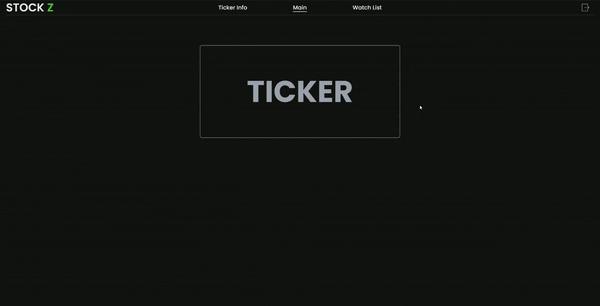
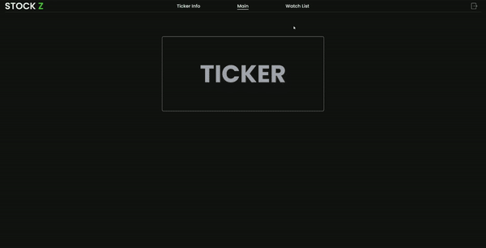

# StockZ
StockZ is a web application designed to assist users in identifying optimal purchasing price ranges for stocks. Leveraging historical data, StockZ provides valuable insights to aid users in making informed decisions.

## Key Features

- **Dynamic Buy Range Assessment:** Instantly discover optimal buy ranges for stocks based on entered ticker symbols, empowering users to make informed investment decisions.

 
  
- **Dynamic Stock Graphs:** Gain valuable insights with graphs of selected stocks, facilitating a deeper understanding of historical performance and trends.
- **Watchlist Management:** Seamlessly add stocks to a personalized watchlist, enabling users to efficiently track their investments.

  
- **Responsive Design:** Features a seamless user experience across all devices with a user-friendly design crafted using Tailwind CSS. Whether on desktop or mobile, the interface remains intuitive and easy to navigate.

## Deployement
This project is deployed at [Stock-Z.com](https://stock-z.com/). Due to the nature of the hosting service, the site may take a moment to load if it has not been accessed recently.

## Technologies Used
- HTML
- Tailwind CSS
- JavaScript
- Python with Flask

